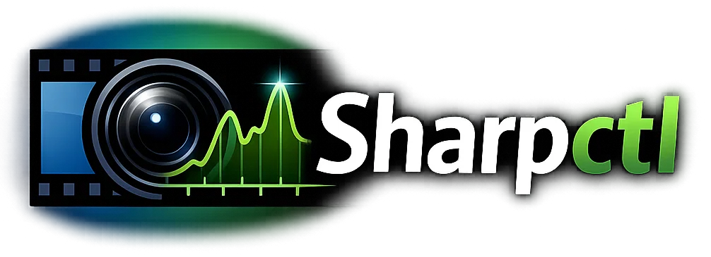
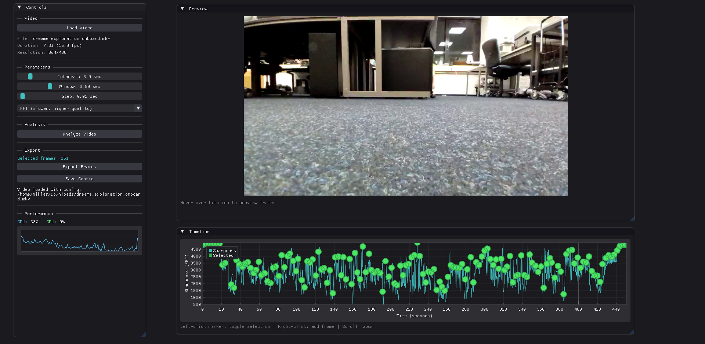

# sharpctl



A video frame extraction tool that automatically selects the sharpest frames at regular intervals. Ideal for creating training datasets for image processing, machine learning, or extracting high-quality stills from video footage.

## Features

- **Automatic sharpness analysis** - Analyzes video frames using FFT or Laplacian variance algorithms 
- **Smart frame selection** - Finds the sharpest frame within a configurable search window around each target time
- **Interactive timeline** - Visual graph showing sharpness over time with clickable frame selection
- **Live preview** - Hover over the timeline to preview frames in real-time
- **Manual refinement** - Add or remove frames with mouse clicks
- **Config persistence** - Saves analysis results and settings alongside videos (`.sharpctl` files)
- **Drag & drop** - Simply drop a video file to load it
- **Performance monitoring** - Real-time CPU/GPU usage graph

## Screenshot



## Building

### Dependencies

- CMake 3.16+
- OpenCV 4.x
- SDL2
- OpenGL 3.3+
- OpenMP

### Ubuntu/Debian

```bash
sudo apt install cmake libopencv-dev libsdl2-dev libgl1-mesa-dev
```

### Arch/Manjaro

```bash
sudo pacman -S cmake opencv sdl2 mesa
```

### Build

```bash
./build.sh
```

Or manually:

```bash
cmake -B build -DCMAKE_BUILD_TYPE=Release
cmake --build build -j$(nproc)
```

The binary will be at `build/sharpctl`.

## Usage

```bash
./build/sharpctl
```

1. **Load a video** - Click "Load Video" or drag & drop a video file
2. **Configure parameters**:
   - **Interval** - Target time between extracted frames (e.g., 3 seconds)
   - **Window** - Search range around each target time (e.g., ±0.5 seconds)
   - **Step** - Precision of the search within the window
   - **Algorithm** - FFT (slower, more accurate) or Laplacian (faster)
3. **Analyze** - Click "Analyze Video" to scan the entire video
4. **Refine** - Left-click markers to toggle selection, right-click to add frames
5. **Export** - Click "Export Frames" to save selected frames as JPG

## Config Files

When you save config, sharpctl creates a `.sharpctl` file alongside your video:

```
myvideo.mp4
myvideo.mp4.sharpctl
```

This file stores:
- Analysis parameters
- Sharpness graph data (for instant reload)
- Selected frame timestamps

When you reopen the same video, your previous analysis and selections are restored automatically.

## Keyboard Shortcuts

| Key | Action |
|-----|--------|
| Escape | Cancel current operation |

## Timeline Interactions

| Action | Effect |
|--------|--------|
| Hover | Preview frame at cursor position |
| Left-click on marker | Toggle frame selection |
| Right-click | Add new frame at cursor position |
| Scroll | Zoom timeline |